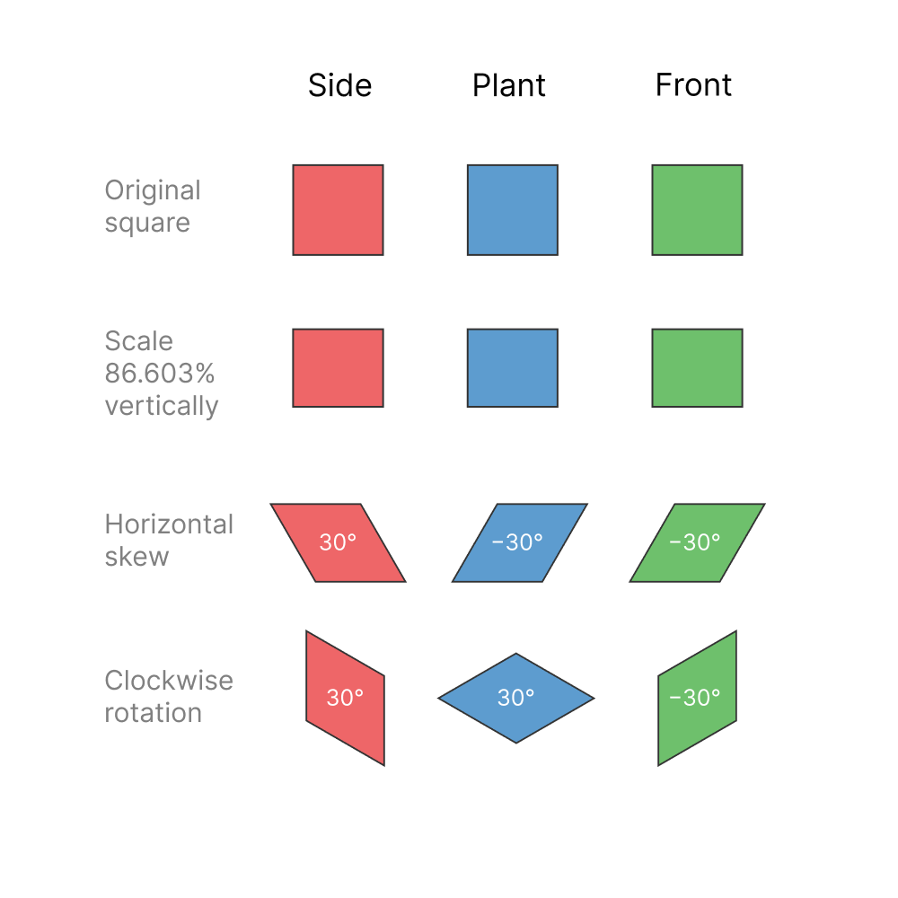

Just want to bookmark this piece of of golden rule for making isometric stuff. You don't need a fancy template. Just create your own isometric graphic with a skewing Figma plugin (like [SkewDat](https://www.figma.com/community/plugin/741472919529947576/SkewDat) ) and reference this. 

